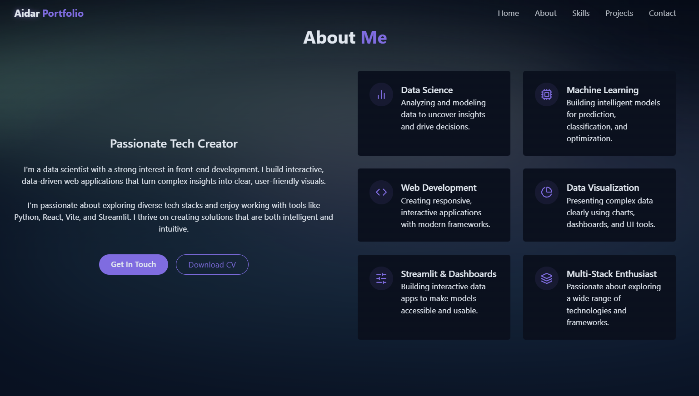
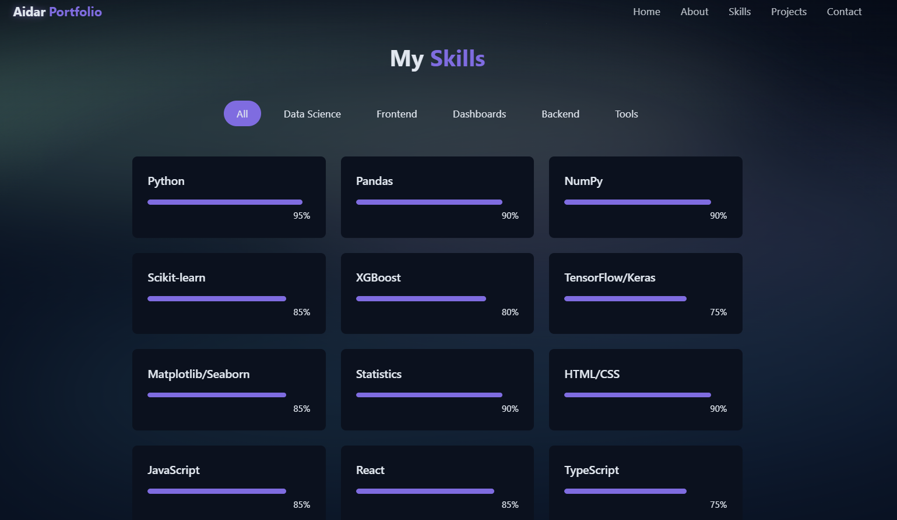

# 🌌 My Portfolio Website

This is a personal portfolio built with **React**, **Vite**, **Tailwind CSS**, and includes effects like a custom **Aurora Borealis background** and a **dark/light mode toggle**.




## ✨ Features

- Responsive and animated UI
- Aurora Borealis background (dark mode)
- Starry sky with meteor animation
- Light/Dark theme toggle
- Contact form with toast notifications
- Environment variable support (Vite)
- Docker-ready setup

## 🛠 Tech Stack

- **Frontend:** React + Vite
- **Styling:** Tailwind CSS
- **Icons:** Lucide
- **Deployment:** Docker
- **Other tools:** Git, GitHub, VS Code

## 🚀 Getting Started

### 1. Clone the repo

```bash
git clone https://github.com/aidarmen/portfolio-web
cd portfolio-web
```

### 2. Install dependencies

```bash
npm install
```

### 3. Run locally

```bash
npm run dev
```

### 4. Environment Variables

Create a `.env` file:

```env
VITE_API_URL=https://your-api.com
VITE_LINKEDIN_URL=https://linkedin.com/in/your-profile
```

### 5. Build for  production

```bash
npm run build
```

## 🐳 Docker Support

```bash
docker-compose up --build
```